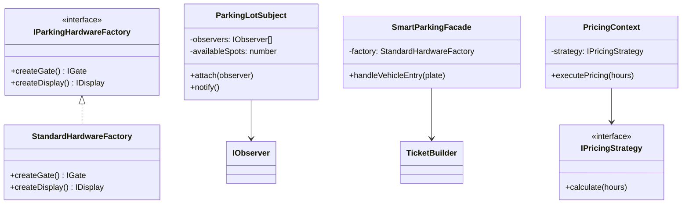

# ParkSim - Smart Parking System Simulation

ParkSim is a smart parking system simulation project built with **Next.js** and **TypeScript**. This project is specifically designed to demonstrate the implementation of various **Design Patterns** in modern software development to create modular, scalable, and maintainable systems.

## 🚀 Main Features

- **Hardware Management**: Simulation of gate control and information display panels.
- **Automatic Ticket System**: Parking ticket creation with flexible configuration.
- **Real-time Monitoring**: Automatic notifications of parking quota changes to Admin and Display Board.
- **Payment Flexibility**: Third-party payment integration support (like Stripe) through adapter system.
- **Pricing Strategy**: Dynamic parking fee calculation (regular vs weekend rates).
- **Additional Services**: Decorator features for adding services like car wash or valet.

## 🛠️ Implemented Design Patterns

This project uses 3 main categories of Design Patterns:

### 1. Creational Patterns

- **Abstract Factory**: Used to differentiate hardware creation between **Standard** and **VIP** types.
- **Builder**: Used in `TicketBuilder` to create complex ticket objects step by step.
- **Prototype**: Used to clone parking level configurations (`ParkingLevel`).

### 2. Structural Patterns

- **Adapter**: Connects internal system with external payment library (`ExternalStripeLib`).
- **Decorator**: Adds additional functionality to basic parking services without modifying the original class.
- **Facade**: Simplifies complex vehicle entry flow into a single simple function through `SmartParkingFacade`.

### 3. Behavioral Patterns

- **Observer**: Manages parking slot availability status updates to various monitors.
- **State**: Manages parking slot state transitions from `Available` to `Occupied` and vice versa.
- **Strategy**: Enables dynamic switching of price calculation algorithms.

## 📊 Class Diagrams

For detailed class diagrams of each design pattern, see the [Design Pattern Diagrams](./docs/diagrams/README.md) documentation.

### Overview Diagram



## 🚀 Getting Started

### Installation

```bash
npm install
```

### Development

```bash
npm run dev
```

### Build

```bash
npm run build
```

### API Endpoint

Test all design patterns by accessing:

```
GET /api/parking
```

This endpoint demonstrates all 9 design patterns with sample outputs.
