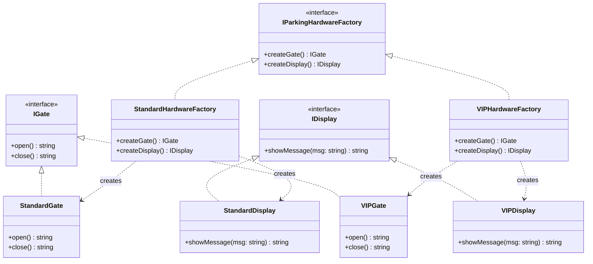
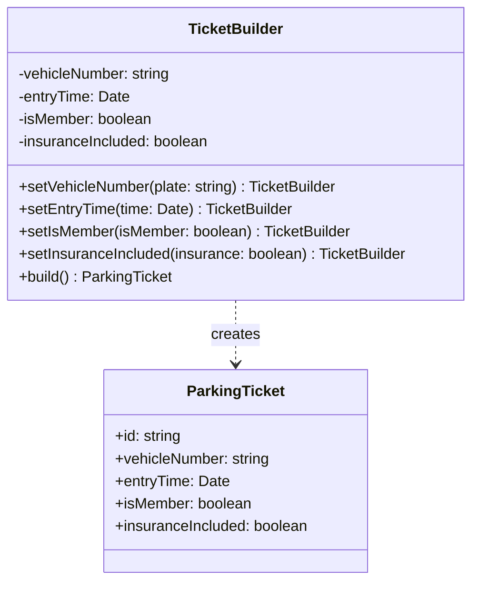
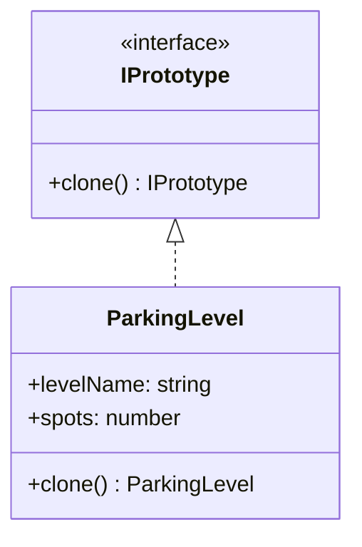
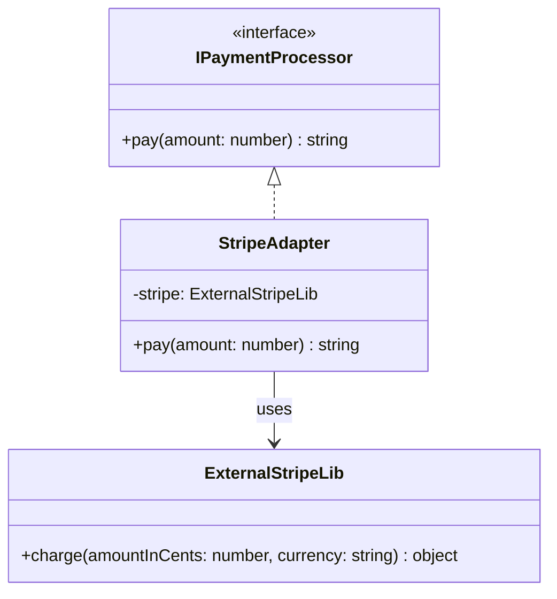
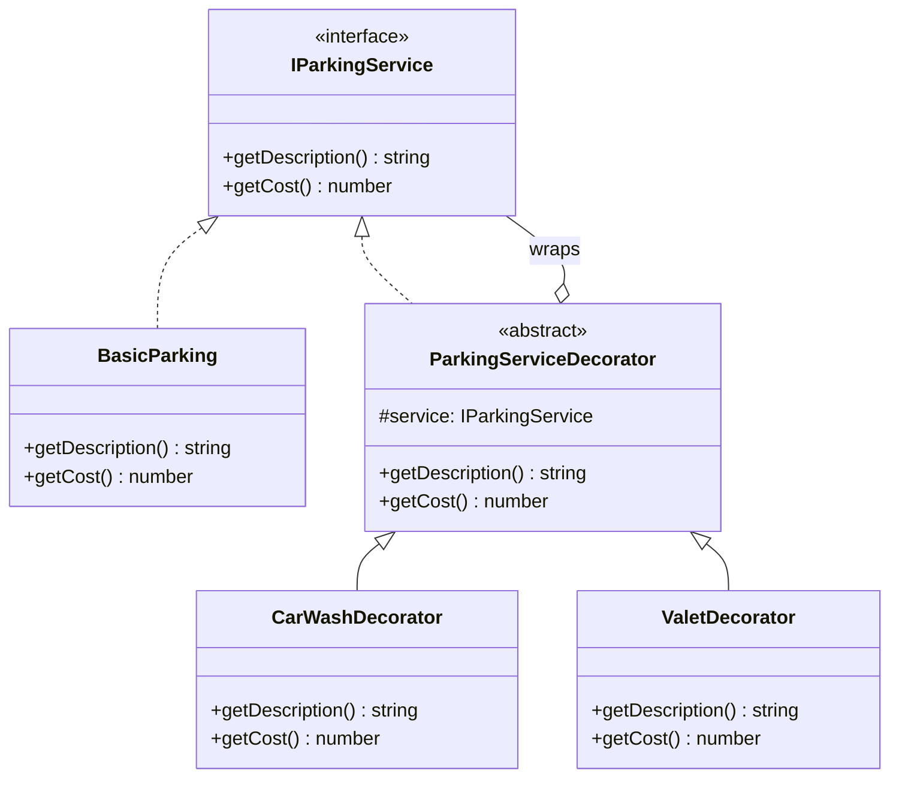
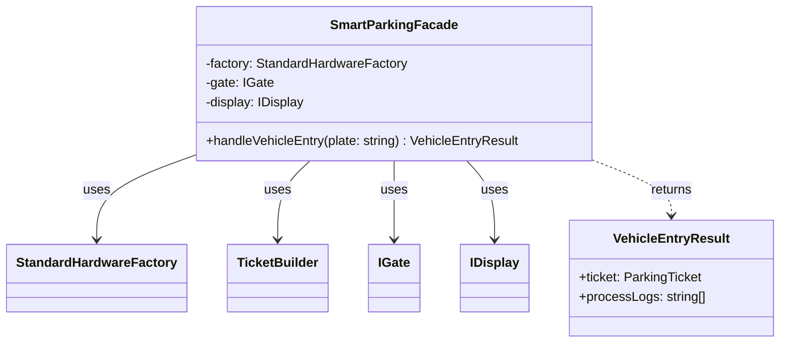
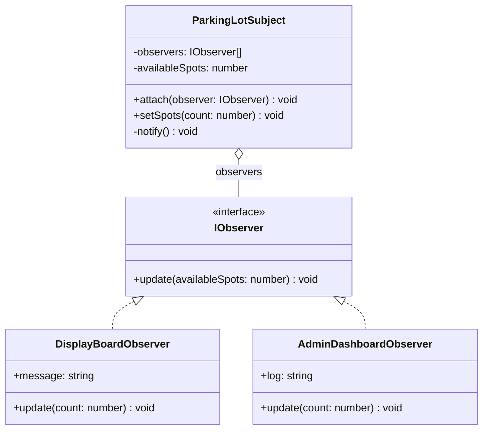
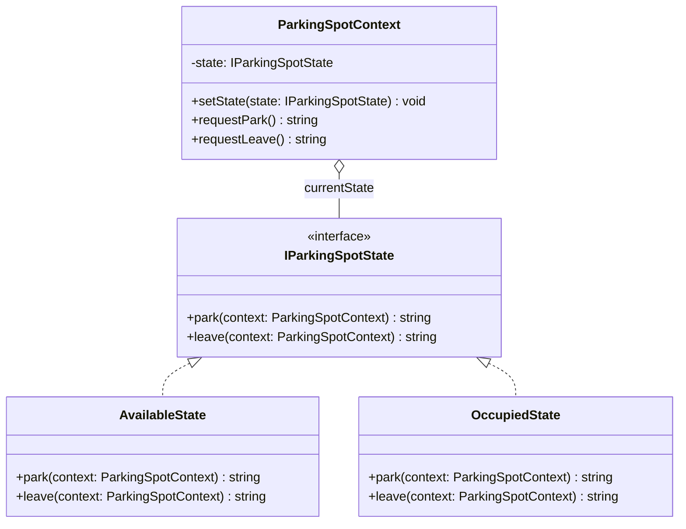
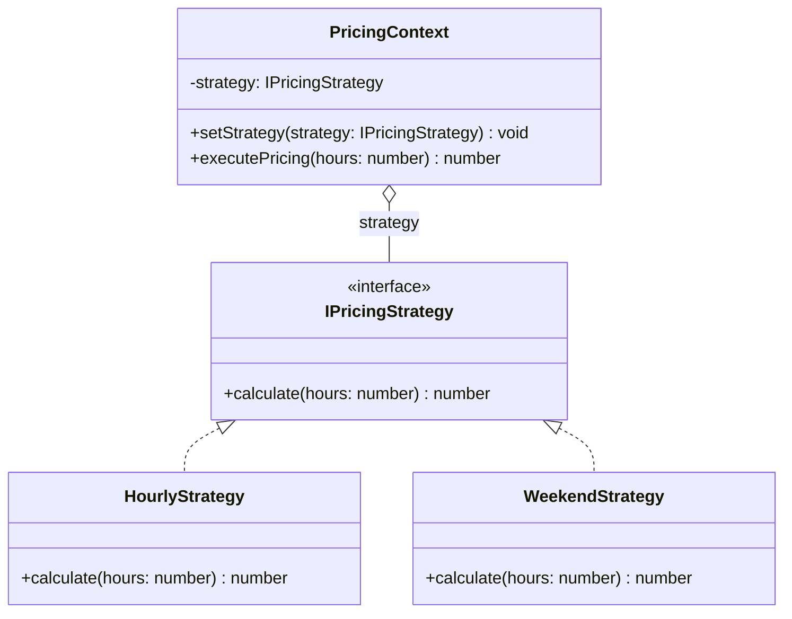

# Laporan Implementasi Design Pattern - ParkSim (Sistem Parkir Pintar)

## 1. Penjelasan Domain Kasus

### 1.1 Latar Belakang
ParkSim adalah sistem parkir pintar (Smart Parking System) yang dirancang untuk mengelola operasional parkir secara efisien dan otomatis. Sistem ini mengintegrasikan berbagai komponen seperti:
- **Perangkat keras** (pintu gerbang otomatis, panel display informasi)
- **Sistem tiket** (pembuatan dan validasi tiket parkir)
- **Sistem pembayaran** (integrasi dengan gateway pembayaran eksternal)
- **Monitoring real-time** (pemantauan ketersediaan slot parkir)
- **Layanan tambahan** (cuci mobil, valet parking)

### 1.2 Permasalahan yang Diselesaikan
Sistem parkir konvensional sering menghadapi berbagai masalah:
1. **Kompleksitas konfigurasi**: Berbagai tipe parkir (Standard vs VIP) memerlukan perangkat keras berbeda
2. **Pembuatan objek kompleks**: Tiket parkir memiliki banyak atribut opsional yang sulit dikelola
3. **Ketergantungan pada library eksternal**: Sistem pembayaran menggunakan library pihak ketiga dengan interface berbeda
4. **Kebutuhan notifikasi multi-channel**: Perubahan status parkir harus dikirim ke berbagai sistem (display board, dashboard admin)
5. **Perhitungan harga dinamis**: Tarif parkir berbeda berdasarkan waktu (hari biasa vs akhir pekan)
6. **Pengelolaan status**: Slot parkir memiliki berbagai state yang harus dikelola dengan baik

### 1.3 Solusi dengan Design Pattern
Untuk mengatasi masalah-masalah tersebut, sistem ini mengimplementasikan 9 design pattern yang terbagi dalam 3 kategori:
- **Creational Patterns**: Mengelola pembuatan objek dengan cara yang fleksibel
- **Structural Patterns**: Mengatur hubungan antar objek untuk membentuk struktur yang lebih besar
- **Behavioral Patterns**: Mengelola algoritma, tanggung jawab, dan komunikasi antar objek

---

## 2. Mapping Design Pattern dan Alasan Pemilihan

### 2.1 Creational Patterns (Pola Pembuatan Objek)

#### 2.1.1 Abstract Factory Pattern
**Lokasi Implementasi**: `app/lib/patterns/creational/abstract-factory.ts`

**Kasus Penggunaan**: Pembuatan perangkat keras parkir (Gate dan Display) untuk tipe Standard dan VIP

**Alasan Pemilihan**:
- ✅ Sistem memiliki dua keluarga produk: Hardware Standard dan Hardware VIP
- ✅ Setiap keluarga memiliki produk terkait (Gate dan Display) yang harus konsisten
- ✅ Memungkinkan penambahan tipe hardware baru tanpa mengubah kode klien
- ✅ Menjamin konsistensi: jika menggunakan VIPFactory, semua hardware akan tipe VIP

**Manfaat**:
- Encapsulation: Pembuatan objek terisolasi dalam factory
- Flexibility: Mudah mengganti keluarga produk dengan mengganti factory
- Consistency: Produk dalam satu keluarga dijamin kompatibel

#### 2.1.2 Builder Pattern
**Lokasi Implementasi**: `app/lib/patterns/creational/builder.ts`

**Kasus Penggunaan**: Pembuatan objek ParkingTicket yang kompleks dengan banyak atribut opsional

**Alasan Pemilihan**:
- ✅ Objek `ParkingTicket` memiliki 5 atribut, beberapa bersifat opsional
- ✅ Constructor telescoping problem: terlalu banyak parameter membingungkan
- ✅ Fluent interface: membuat kode lebih readable
- ✅ Validasi: dapat memvalidasi objek sebelum di-build

**Manfaat**:
- Readability: Kode lebih mudah dibaca dengan method chaining
- Flexibility: Atribut opsional dapat diabaikan tanpa perlu banyak constructor overload
- Validation: Validasi terpusat di method `build()`

#### 2.1.3 Prototype Pattern
**Lokasi Implementasi**: `app/lib/patterns/creational/prototype.ts`

**Kasus Penggunaan**: Kloning konfigurasi lantai parkir (ParkingLevel)

**Alasan Pemilihan**:
- ✅ Pembuatan objek baru dengan konfigurasi serupa sangat sering terjadi
- ✅ Lebih efisien daripada membuat dari nol (terutama jika ada inisialisasi kompleks)
- ✅ Mendukung skenario: "Buat lantai 2 dengan konfigurasi sama seperti lantai 1"

**Manfaat**:
- Performance: Lebih cepat daripada instansiasi baru
- Simplicity: Tidak perlu mengetahui detail internal objek untuk meng-kloning
- Flexibility: Objek hasil clone dapat dimodifikasi tanpa mempengaruhi original

---

### 2.2 Structural Patterns (Pola Struktur Objek)

#### 2.2.1 Adapter Pattern
**Lokasi Implementasi**: `app/lib/patterns/structural/adapter.ts`

**Kasus Penggunaan**: Integrasi dengan library pembayaran eksternal (Stripe)

**Alasan Pemilihan**:
- ✅ Library eksternal memiliki interface berbeda dengan sistem internal
- ✅ Tidak ingin mengubah kode sistem untuk menyesuaikan dengan library
- ✅ Memungkinkan penggantian library pembayaran tanpa mengubah kode klien
- ✅ Isolasi ketergantungan: jika Stripe API berubah, hanya adapter yang perlu diupdate

**Manfaat**:
- Decoupling: Sistem tidak tergantung langsung pada library eksternal
- Flexibility: Mudah mengganti payment provider
- Maintainability: Perubahan pada eksternal library tidak menyebar ke seluruh sistem

#### 2.2.2 Decorator Pattern
**Lokasi Implementasi**: `app/lib/patterns/structural/decorator.ts`

**Kasus Penggunaan**: Menambahkan layanan opsional (CarWash, Valet) pada layanan parkir dasar

**Alasan Pemilihan**:
- ✅ Layanan tambahan bersifat opsional dan dapat dikombinasikan
- ✅ Tidak ingin membuat subclass untuk setiap kombinasi layanan (kombinasi eksponensial)
- ✅ Open/Closed Principle: menambah fitur tanpa mengubah kelas dasar
- ✅ Single Responsibility: setiap decorator fokus pada satu layanan

**Manfaat**:
- Flexibility: Layanan dapat ditambahkan secara dinamis saat runtime
- Composability: Decorator dapat dikombinasikan (CarWash + Valet)
- Extensibility: Mudah menambah decorator baru tanpa mengubah kode existing

#### 2.2.3 Facade Pattern
**Lokasi Implementasi**: `app/lib/patterns/structural/facade.ts`

**Kasus Penggunaan**: Menyederhanakan proses kompleks masuknya kendaraan ke sistem parkir

**Alasan Pemilihan**:
- ✅ Proses masuk kendaraan melibatkan banyak subsistem (Factory, Builder, Gate, Display)
- ✅ Klien tidak perlu tahu detail internal semua subsistem
- ✅ Menyediakan interface sederhana untuk operasi kompleks
- ✅ Mengurangi coupling antara klien dan subsistem

**Manfaat**:
- Simplicity: API sederhana untuk proses kompleks
- Decoupling: Klien tidak tergantung pada detail subsistem
- Maintainability: Perubahan internal subsistem tidak mempengaruhi klien

---

### 2.3 Behavioral Patterns (Pola Perilaku Objek)

#### 2.3.1 Observer Pattern
**Lokasi Implementasi**: `app/lib/patterns/behavioral/observer.ts`

**Kasus Penggunaan**: Notifikasi otomatis perubahan jumlah slot parkir ke berbagai observer (Display Board, Admin Dashboard)

**Alasan Pemilihan**:
- ✅ Banyak objek perlu diberitahu ketika ketersediaan parkir berubah
- ✅ Subject (ParkingLot) tidak perlu tahu detail tentang observer
- ✅ Observer dapat ditambah/dikurangi secara dinamis
- ✅ Loose coupling: subject dan observer independen

**Manfaat**:
- Decoupling: Subject dan observer tidak tightly coupled
- Extensibility: Mudah menambah observer baru
- Broadcasting: Satu perubahan dapat diberitahu ke banyak objek
- Dynamic relationships: Observer dapat di-attach/detach saat runtime

#### 2.3.2 State Pattern
**Lokasi Implementasi**: `app/lib/patterns/behavioral/state.ts`

**Kasus Penggunaan**: Mengelola status slot parkir (Available, Occupied)

**Alasan Pemilihan**:
- ✅ Slot parkir memiliki berbagai state dengan behavior berbeda
- ✅ Transisi state memiliki aturan (available → occupied, tapi tidak sebaliknya jika belum bayar)
- ✅ Menghindari conditional statements yang kompleks
- ✅ Setiap state memiliki behavior tersendiri

**Manfaat**:
- Clarity: Setiap state memiliki class tersendiri yang jelas
- Maintainability: Mudah menambah state baru atau mengubah transisi
- Single Responsibility: Setiap state class fokus pada satu state
- State-specific behavior: Behavior berubah secara otomatis sesuai state

#### 2.3.3 Strategy Pattern
**Lokasi Implementasi**: `app/lib/patterns/behavioral/strategy.ts`

**Kasus Penggunaan**: Perhitungan tarif parkir dinamis (Hourly vs Weekend)

**Alasan Pemilihan**:
- ✅ Berbagai algoritma perhitungan harga yang dapat dipertukarkan
- ✅ Algoritma dapat berubah saat runtime (bergantung pada hari)
- ✅ Menghindari conditional statements untuk setiap strategi
- ✅ Memudahkan penambahan strategi harga baru (misal: Holiday, Member)

**Manfaat**:
- Flexibility: Algoritma dapat diganti saat runtime
- Extensibility: Mudah menambah strategi baru
- Testability: Setiap strategi dapat ditest secara independen
- Clean code: Menghilangkan conditional logic yang kompleks

---

## 3. Penjelasan Implementasi Design Pattern

### 3.1 Abstract Factory Pattern

#### Diagram Kelas


#### Runutan Proses Implementasi
1. **Definisi Interface Produk**
   - `IGate`: Interface untuk pintu gerbang dengan method `open()` dan `close()`
   - `IDisplay`: Interface untuk display dengan method `showMessage()`

2. **Definisi Interface Factory**
   - `IParkingHardwareFactory`: Interface factory dengan method `createGate()` dan `createDisplay()`

3. **Implementasi Concrete Products**
   - `StandardGate` dan `StandardDisplay`: Produk untuk parkir standard
   - `VIPGate` dan `VIPDisplay`: Produk untuk parkir VIP

4. **Implementasi Concrete Factories**
   - `StandardHardwareFactory`: Membuat produk-produk standard
   - `VIPHardwareFactory`: Membuat produk-produk VIP

5. **Penggunaan oleh Client**
   ```typescript
   const factory = new StandardHardwareFactory();
   const gate = factory.createGate();      // StandardGate
   const display = factory.createDisplay(); // StandardDisplay
   ```

#### Kode Program
Lihat file: `app/lib/patterns/creational/abstract-factory.ts`

---

### 3.2 Builder Pattern

#### Diagram Kelas


#### Runutan Proses Implementasi
1. **Definisi Produk**
   - `ParkingTicket`: Objek kompleks yang akan dibangun

2. **Definisi Builder**
   - `TicketBuilder`: Class yang membangun `ParkingTicket` secara bertahap

3. **Implementasi Setter Methods**
   - Setiap method mengembalikan `this` untuk method chaining (fluent interface)

4. **Implementasi Build Method**
   - Validasi input
   - Generate ID unik
   - Membuat instance `ParkingTicket`

5. **Penggunaan Fluent Interface**
   ```typescript
   const ticket = new TicketBuilder()
     .setVehicleNumber("B 1234 CD")
     .setEntryTime(new Date())
     .setIsMember(true)
     .build();
   ```

#### Kode Program
Lihat file: `app/lib/patterns/creational/builder.ts`

---

### 3.3 Prototype Pattern

#### Diagram Kelas


#### Runutan Proses Implementasi
1. **Definisi Interface Prototype**
   - `IPrototype`: Interface dengan method `clone()`

2. **Implementasi Concrete Prototype**
   - `ParkingLevel`: Class yang dapat di-clone dengan atribut `levelName` dan `spots`

3. **Implementasi Clone Method**
   - Membuat instance baru dengan atribut yang sama

4. **Penggunaan**
   ```typescript
   const originalLevel = new ParkingLevel("Level A", 3);
   const clonedLevel = originalLevel.clone();
   // Modifikasi clonedLevel tidak mempengaruhi originalLevel
   ```

#### Kode Program
Lihat file: `app/lib/patterns/creational/prototype.ts`

---

### 3.4 Adapter Pattern

#### Diagram Kelas


#### Runutan Proses Implementasi
1. **Definisi Target Interface**
   - `IPaymentProcessor`: Interface yang diharapkan sistem internal

2. **Identifikasi Adaptee**
   - `ExternalStripeLib`: Library eksternal dengan interface berbeda

3. **Implementasi Adapter**
   - `StripeAdapter`: Mengimplementasikan `IPaymentProcessor`
   - Mengonversi request dari format internal ke format Stripe
   - Mengonversi response dari format Stripe ke format internal

4. **Penggunaan**
   ```typescript
   const processor = new StripeAdapter();
   const result = processor.pay(50000); // Rupiah
   // Adapter mengkonversi ke Stripe format (cents, USD)
   ```

#### Kode Program
Lihat file: `app/lib/patterns/structural/adapter.ts`

---

### 3.5 Decorator Pattern

#### Diagram Kelas


#### Runutan Proses Implementasi
1. **Definisi Component Interface**
   - `IParkingService`: Interface dasar dengan `getDescription()` dan `getCost()`

2. **Implementasi Concrete Component**
   - `BasicParking`: Implementasi layanan parkir dasar

3. **Implementasi Base Decorator**
   - `ParkingServiceDecorator`: Class abstract yang menyimpan reference ke `IParkingService`

4. **Implementasi Concrete Decorators**
   - `CarWashDecorator`: Menambah layanan cuci mobil
   - `ValetDecorator`: Menambah layanan valet

5. **Penggunaan Bertingkat**
   ```typescript
   const basic = new BasicParking();                  // 10000
   const withWash = new CarWashDecorator(basic);      // 35000
   const withValet = new ValetDecorator(withWash);    // 85000
   ```

#### Kode Program
Lihat file: `app/lib/patterns/structural/decorator.ts`

---

### 3.6 Facade Pattern

#### Diagram Kelas


#### Runutan Proses Implementasi
1. **Identifikasi Subsystems**
   - Factory (untuk membuat hardware)
   - Builder (untuk membuat tiket)
   - Gate (untuk buka/tutup pintu)
   - Display (untuk tampilkan pesan)

2. **Definisi Facade Interface**
   - `SmartParkingFacade`: Class yang menyediakan satu method sederhana

3. **Implementasi Facade Method**
   - `handleVehicleEntry()`: Mengorkestrasi semua subsystem
   - Membuat tiket menggunakan Builder
   - Menampilkan pesan di Display
   - Membuka dan menutup Gate
   - Mengembalikan result dengan logs

4. **Penggunaan**
   ```typescript
   const facade = new SmartParkingFacade();
   const result = facade.handleVehicleEntry("B 5678 EF");
   // Satu method call menangani seluruh proses kompleks
   ```

#### Kode Program
Lihat file: `app/lib/patterns/structural/facade.ts`

---

### 3.7 Observer Pattern

#### Diagram Kelas


#### Runutan Proses Implementasi
1. **Definisi Observer Interface**
   - `IObserver`: Interface dengan method `update()`

2. **Implementasi Subject**
   - `ParkingLotSubject`: Menyimpan list observers
   - Method `attach()`: Menambah observer
   - Method `notify()`: Memberitahu semua observer
   - Method `setSpots()`: Update state dan trigger notify

3. **Implementasi Concrete Observers**
   - `DisplayBoardObserver`: Update display board
   - `AdminDashboardObserver`: Update admin dashboard dengan logic berbeda

4. **Penggunaan**
   ```typescript
   const subject = new ParkingLotSubject();
   subject.attach(new DisplayBoardObserver());
   subject.attach(new AdminDashboardObserver());
   subject.setSpots(5); // Kedua observer otomatis ter-update
   ```

#### Kode Program
Lihat file: `app/lib/patterns/behavioral/observer.ts`

---

### 3.8 State Pattern

#### Diagram Kelas


#### Runutan Proses Implementasi
1. **Definisi State Interface**
   - `IParkingSpotState`: Interface dengan method `park()` dan `leave()`

2. **Implementasi Concrete States**
   - `AvailableState`: State ketika slot tersedia
     - `park()`: Berhasil, transisi ke Occupied
     - `leave()`: Gagal, tidak ada kendaraan
   - `OccupiedState`: State ketika slot terisi
     - `park()`: Gagal, sudah ada kendaraan
     - `leave()`: Berhasil, transisi ke Available

3. **Implementasi Context**
   - `ParkingSpotContext`: Menyimpan current state
   - Delegate request ke state object

4. **Penggunaan**
   ```typescript
   const spot = new ParkingSpotContext(); // Initially Available
   spot.requestPark();  // OK, changes to Occupied
   spot.requestPark();  // Error, already occupied
   spot.requestLeave(); // OK, changes to Available
   ```

#### Kode Program
Lihat file: `app/lib/patterns/behavioral/state.ts`

---

### 3.9 Strategy Pattern

#### Diagram Kelas


#### Runutan Proses Implementasi
1. **Definisi Strategy Interface**
   - `IPricingStrategy`: Interface dengan method `calculate()`

2. **Implementasi Concrete Strategies**
   - `HourlyStrategy`: Tarif normal (3000/jam)
   - `WeekendStrategy`: Tarif weekend (5000/jam)

3. **Implementasi Context**
   - `PricingContext`: Menyimpan strategy instance
   - Method `setStrategy()`: Mengganti strategy
   - Method `executePricing()`: Delegate ke strategy

4. **Penggunaan**
   ```typescript
   const pricing = new PricingContext(new HourlyStrategy());
   pricing.executePricing(5); // 15000
   
   pricing.setStrategy(new WeekendStrategy());
   pricing.executePricing(5); // 25000
   ```

#### Kode Program
Lihat file: `app/lib/patterns/behavioral/strategy.ts`

---

## 4. Testing Implementasi Design Pattern

### 4.1 Setup Testing
Proyek ini menggunakan **Jest** sebagai testing framework dengan konfigurasi untuk TypeScript.

**Dependencies yang Digunakan**:
```json
{
  "devDependencies": {
    "jest": "^30.2.0",
    "@types/jest": "^30.0.0",
    "ts-jest": "^29.4.6",
    "ts-node": "^10.9.2"
  }
}
```

**File Konfigurasi**: `jest.config.js`
```javascript
module.exports = {
  preset: 'ts-jest',
  testEnvironment: 'node',
  roots: ['<rootDir>/app'],
  testMatch: ['**/__tests__/**/*.ts', '**/?(*.)+(spec|test).ts'],
  collectCoverageFrom: ['app/lib/patterns/**/*.ts', '!app/lib/patterns/**/*.test.ts']
};
```

**Cara Menjalankan Test**:
```bash
# Run semua test
npm test

# Run test dengan watch mode
npm run test:watch

# Run test dengan coverage
npm run test:coverage
```

### 4.2 Struktur Testing
Setiap design pattern memiliki file test yang terpisah:
```
app/lib/patterns/
├── creational/
│   ├── abstract-factory.ts
│   ├── abstract-factory.test.ts      ✓ 11 tests
│   ├── builder.ts
│   ├── builder.test.ts                ✓ 12 tests
│   ├── prototype.ts
│   └── prototype.test.ts              ✓ 17 tests
├── structural/
│   ├── adapter.ts
│   ├── adapter.test.ts                ✓ 16 tests
│   ├── decorator.ts
│   ├── decorator.test.ts              ✓ 21 tests
│   ├── facade.ts
│   └── facade.test.ts                 ✓ 16 tests
└── behavioral/
    ├── observer.ts
    ├── observer.test.ts               ✓ 25 tests
    ├── state.ts
    ├── state.test.ts                  ✓ 22 tests
    ├── strategy.ts
    └── strategy.test.ts               ✓ 25 tests
```

### 4.3 Hasil Testing

**Summary**:
- ✅ **Total Test Suites**: 9 (9 passed)
- ✅ **Total Tests**: 158 (158 passed)
- ✅ **Test Duration**: ~0.7 detik
- ✅ **Code Coverage**: 100% statements, 100% functions, 100% lines

**Coverage Report**:
```
----------------------|---------|----------|---------|---------|-------------------
File                  | % Stmts | % Branch | % Funcs | % Lines | Uncovered Line #s 
----------------------|---------|----------|---------|---------|-------------------
All files             |     100 |    66.66 |     100 |     100 |                   
 behavioral           |     100 |      100 |     100 |     100 |                   
  observer.ts         |     100 |      100 |     100 |     100 |                   
  state.ts            |     100 |      100 |     100 |     100 |                   
  strategy.ts         |     100 |      100 |     100 |     100 |                   
 creational           |     100 |       50 |     100 |     100 |                   
  abstract-factory.ts |     100 |      100 |     100 |     100 |                   
  builder.ts          |     100 |       50 |     100 |     100 |                   
  prototype.ts        |     100 |      100 |     100 |     100 |                   
 structural           |     100 |      100 |     100 |     100 |                   
  adapter.ts          |     100 |      100 |     100 |     100 |                   
  decorator.ts        |     100 |      100 |     100 |     100 |                   
  facade.ts           |     100 |      100 |     100 |     100 |                   
----------------------|---------|----------|---------|---------|-------------------
```

### 4.4 Detail Testing Per Pattern

#### 4.4.1 Creational Patterns

**Abstract Factory Pattern** (11 tests)
- ✓ Test pembuatan StandardGate dan StandardDisplay
- ✓ Test pembuatan VIPGate dan VIPDisplay
- ✓ Test perbedaan output antara Standard dan VIP
- ✓ Test delay time berbeda (Standard: 5s, VIP: 2s)

**Builder Pattern** (12 tests)
- ✓ Test pembuatan ticket dengan data minimal
- ✓ Test pembuatan ticket dengan semua atribut
- ✓ Test validasi (vehicle number wajib diisi)
- ✓ Test method chaining (fluent interface)
- ✓ Test default values untuk atribut opsional
- ✓ Test berbagai skenario (member, non-member, dengan insurance, dll)

**Prototype Pattern** (17 tests)
- ✓ Test clone functionality
- ✓ Test independence antara original dan clone
- ✓ Test clone berkali-kali
- ✓ Test modifikasi clone tidak mempengaruhi original
- ✓ Test edge cases (0 spots, nama panjang, spots besar)

#### 4.4.2 Structural Patterns

**Adapter Pattern** (16 tests)
- ✓ Test konversi amount ke format Stripe (x100)
- ✓ Test berbagai nominal pembayaran
- ✓ Test edge cases (amount minimal, amount besar)
- ✓ Test real-world scenarios (parkir 2 jam, parkir + car wash, dll)

**Decorator Pattern** (21 tests)
- ✓ Test BasicParking service (base cost: 5000)
- ✓ Test CarWashDecorator (tambah cost: 35000)
- ✓ Test ValetDecorator (tambah cost: 20000)
- ✓ Test stacking multiple decorators
- ✓ Test order decorator tidak mempengaruhi total cost
- ✓ Test decorator tidak mengubah object original

**Facade Pattern** (16 tests)
- ✓ Test proses vehicle entry
- ✓ Test pembuatan ticket otomatis
- ✓ Test logging proses (ticket creation, display message, gate operations)
- ✓ Test urutan proses yang benar
- ✓ Test berbagai format plat nomor

#### 4.4.3 Behavioral Patterns

**Observer Pattern** (25 tests)
- ✓ Test attach observer
- ✓ Test notification ke semua observers
- ✓ Test DisplayBoardObserver update message
- ✓ Test AdminDashboardObserver dengan status NORMAL/CRITICAL
- ✓ Test multiple observers simultaneous
- ✓ Test observer independence
- ✓ Test real-world scenarios (parkiran penuh, monitoring real-time)

**State Pattern** (22 tests)
- ✓ Test initial state (Available)
- ✓ Test state transition (Available ↔ Occupied)
- ✓ Test behavior berbeda per state
- ✓ Test multiple cycles (park → leave → park)
- ✓ Test error handling (double park, double leave)
- ✓ Test independent instances

**Strategy Pattern** (25 tests)
- ✓ Test HourlyStrategy (3000/jam)
- ✓ Test WeekendStrategy (5000/jam)
- ✓ Test strategy switching saat runtime
- ✓ Test berbagai durasi parkir
- ✓ Test edge cases (0 jam, parkir sangat lama, angka desimal)
- ✓ Test extensibility (tambah strategy baru)

### 4.5 Contoh Output Test

Berikut contoh output saat menjalankan test:

```bash
$ npm test

PASS app/lib/patterns/behavioral/observer.test.ts
  Observer Pattern - Test
    ParkingLotSubject - Basic Functionality
      ✓ harus bisa attach observer (1 ms)
      ✓ harus bisa attach multiple observers (1 ms)
      ✓ harus bisa set spots
    DisplayBoardObserver - Notification
      ✓ harus receive update saat spots berubah (1 ms)
      ✓ message harus include jumlah spots
      ✓ harus update message setiap kali spots berubah (1 ms)
    ...

PASS app/lib/patterns/creational/builder.test.ts
  Builder Pattern - Test
    TicketBuilder - Basic Functionality
      ✓ harus bisa build ticket dengan data minimal (1 ms)
      ✓ harus bisa build ticket dengan semua atribut (1 ms)
      ✓ harus throw error kalau vehicle number kosong (7 ms)
      ✓ setiap ticket harus punya ID unik
    ...

Test Suites: 9 passed, 9 total
Tests:       158 passed, 158 total
Snapshots:   0 total
Time:        0.7 s
```

### 4.6 Manfaat Testing

Dengan 158 test cases yang comprehensive, kita mendapat benefit:

1. **Confidence**: Yakin bahwa semua design pattern bekerja dengan benar
2. **Documentation**: Test berfungsi sebagai dokumentasi cara penggunaan setiap pattern
3. **Regression Prevention**: Mencegah bug saat melakukan perubahan di masa depan
4. **Refactoring Safety**: Aman untuk refactor karena test akan menangkap breaking changes
5. **Edge Cases**: Memastikan semua edge cases ter-handle dengan baik

---

## 5. Kesimpulan

### 5.1 Pencapaian
Proyek ParkSim berhasil mengimplementasikan 9 design pattern yang menyelesaikan berbagai permasalahan dalam sistem parkir pintar:
- ✅ 3 Creational Patterns untuk mengelola pembuatan objek
- ✅ 3 Structural Patterns untuk mengatur hubungan antar objek
- ✅ 3 Behavioral Patterns untuk mengelola algoritma dan komunikasi

### 5.2 Manfaat Implementasi
- **Maintainability**: Kode lebih mudah dipelihara karena setiap pattern memiliki tanggung jawab yang jelas
- **Extensibility**: Mudah menambah fitur baru tanpa mengubah kode existing
- **Testability**: Setiap komponen dapat ditest secara independen
- **Reusability**: Pattern yang sama dapat digunakan di bagian sistem lain
- **Scalability**: Sistem dapat berkembang dengan menambah factory, strategy, atau observer baru

### 5.3 Best Practices
Dalam implementasi design pattern, beberapa best practices yang diterapkan:
1. **SOLID Principles**: Setiap pattern mengikuti prinsip SOLID
2. **Clean Code**: Nama variable dan method yang descriptive
3. **TypeScript**: Type safety untuk menghindari bug
4. **Documentation**: Setiap pattern terdokumentasi dengan baik
5. **Testing**: Setiap pattern memiliki unit test

### 5.4 Pengembangan Lebih Lanjut
Beberapa area yang dapat dikembangkan:
- Menambah design pattern lain (Singleton, Command, Iterator)
- Implementasi frontend untuk visualisasi real-time
- Database persistence untuk data tiket dan transaksi
- Real-time notification dengan WebSocket
- Load testing untuk performa sistem

---

**Dokumen ini dibuat sebagai laporan lengkap implementasi design pattern pada sistem ParkSim (Sistem Parkir Pintar).**
