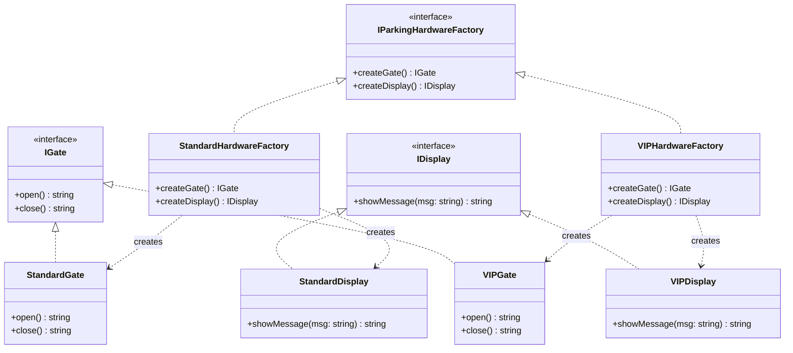

# Abstract Factory Pattern

The Abstract Factory pattern provides an interface for creating families of related or dependent objects without specifying their concrete classes.

## Class Diagram



## Usage

```typescript
const standardFactory = new StandardHardwareFactory();
const gate = standardFactory.createGate();
const display = standardFactory.createDisplay();

gate.open();                    // "Opening standard gates. (delay 5s)"
display.showMessage("Welcome"); // "[LCD Panel]: Welcome"

const vipFactory = new VIPHardwareFactory();
const vipGate = vipFactory.createGate();
vipGate.open(); // "Opening VIP gates. (delay 2s)"
```
