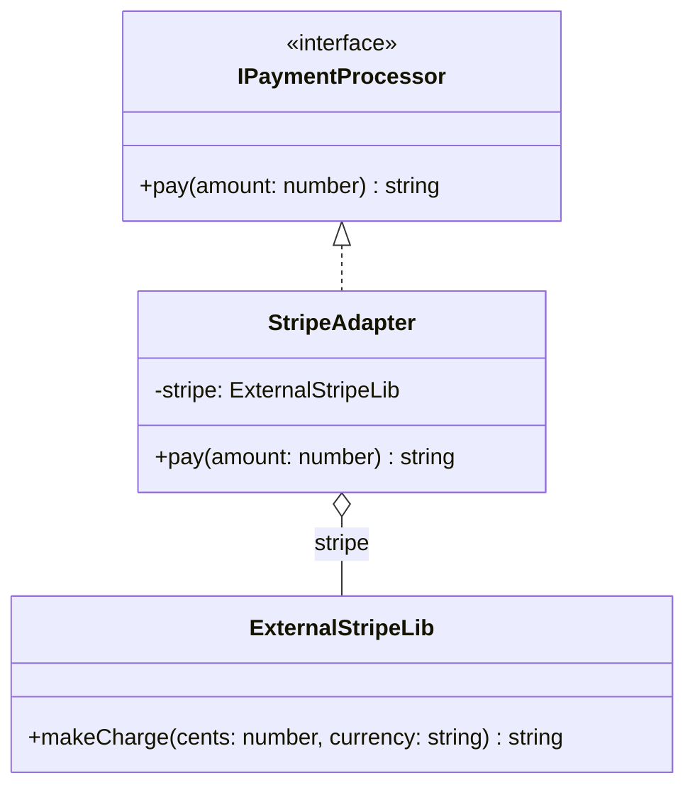

# Adapter Pattern

The Adapter pattern converts the interface of a class into another interface clients expect. Adapter lets classes work together that couldn't otherwise because of incompatible interfaces.

## Class Diagram



## Usage

```typescript
const paymentProcessor: IPaymentProcessor = new StripeAdapter();
paymentProcessor.pay(50000); // "Stripe charged 5000000 IDR"
```
