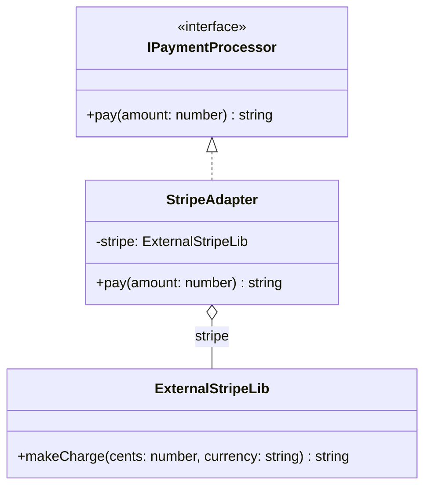

# Adapter Pattern

Adapter pattern mengkonversi antarmuka sebuah kelas menjadi antarmuka lain yang diharapkan klien. Adapter memungkinkan kelas-kelas bekerja bersama yang sebelumnya tidak bisa karena antarmuka yang tidak kompatibel.

## Diagram Kelas



## Penggunaan

```typescript
const paymentProcessor: IPaymentProcessor = new StripeAdapter();
paymentProcessor.pay(50000); // "Stripe charged 5000000 IDR"
```
