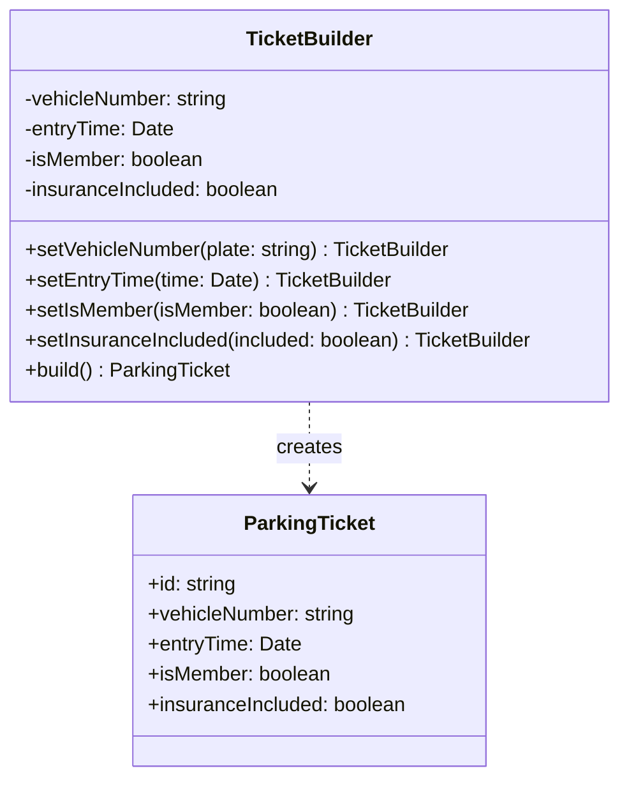

# Builder Pattern

The Builder pattern separates the construction of a complex object from its representation so that the same construction process can create different representations.

## Class Diagram



## Usage

```typescript
const ticket = new TicketBuilder()
  .setVehicleNumber("B 1234 CD")
  .setEntryTime(new Date())
  .setIsMember(true)
  .setInsuranceIncluded(true)
  .build();
```
