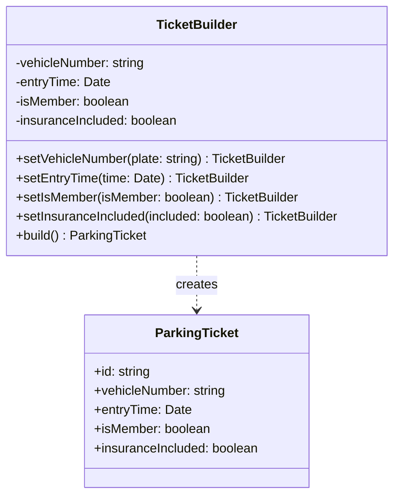

# Builder Pattern

Builder pattern memisahkan konstruksi objek kompleks dari representasinya sehingga proses konstruksi yang sama dapat membuat representasi yang berbeda.

## Diagram Kelas



## Penggunaan

```typescript
const ticket = new TicketBuilder()
  .setVehicleNumber("B 1234 CD")
  .setEntryTime(new Date())
  .setIsMember(true)
  .setInsuranceIncluded(true)
  .build();
```
