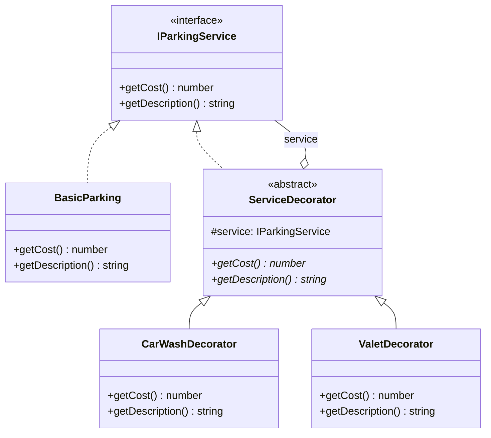

# Decorator Pattern

Decorator pattern menambahkan tanggung jawab tambahan ke objek secara dinamis. Decorator menyediakan alternatif yang fleksibel untuk subclassing dalam memperluas fungsionalitas.

## Diagram Kelas



## Penggunaan

```typescript
let service: IParkingService = new BasicParking();
service = new CarWashDecorator(service);
service = new ValetDecorator(service);

service.getCost();        // 60000 (5000 + 35000 + 20000)
service.getDescription(); // "Basic Parking + Car Wash + Valet Service"
```
