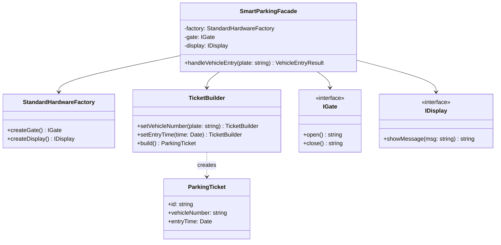

# Facade Pattern

The Facade pattern provides a unified interface to a set of interfaces in a subsystem. Facade defines a higher-level interface that makes the subsystem easier to use.

## Class Diagram



## Usage

```typescript
const facade = new SmartParkingFacade();
const result = facade.handleVehicleEntry("B 1234 CD");
// Returns: { ticket: ParkingTicket, processLogs: string[] }
```
