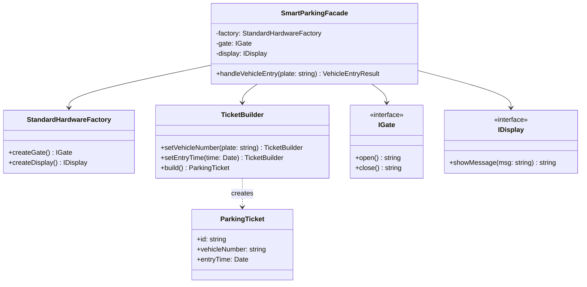

# Facade Pattern

Facade pattern menyediakan antarmuka terpadu untuk sekumpulan antarmuka dalam sebuah subsistem. Facade mendefinisikan antarmuka tingkat tinggi yang membuat subsistem lebih mudah digunakan.

## Diagram Kelas



## Penggunaan

```typescript
const facade = new SmartParkingFacade();
const result = facade.handleVehicleEntry("B 1234 CD");
// Mengembalikan: { ticket: ParkingTicket, processLogs: string[] }
```
