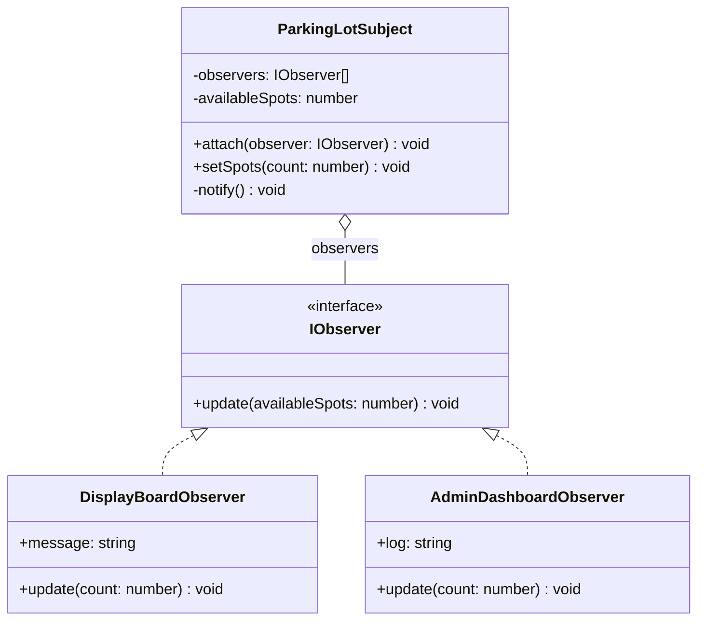

# Observer Pattern

The Observer pattern defines a one-to-many dependency between objects so that when one object changes state, all its dependents are notified and updated automatically.

## Class Diagram



## Usage

```typescript
const parkingLot = new ParkingLotSubject();
const display = new DisplayBoardObserver();
const admin = new AdminDashboardObserver();

parkingLot.attach(display);
parkingLot.attach(admin);
parkingLot.setSpots(5); // Both observers are notified
```
