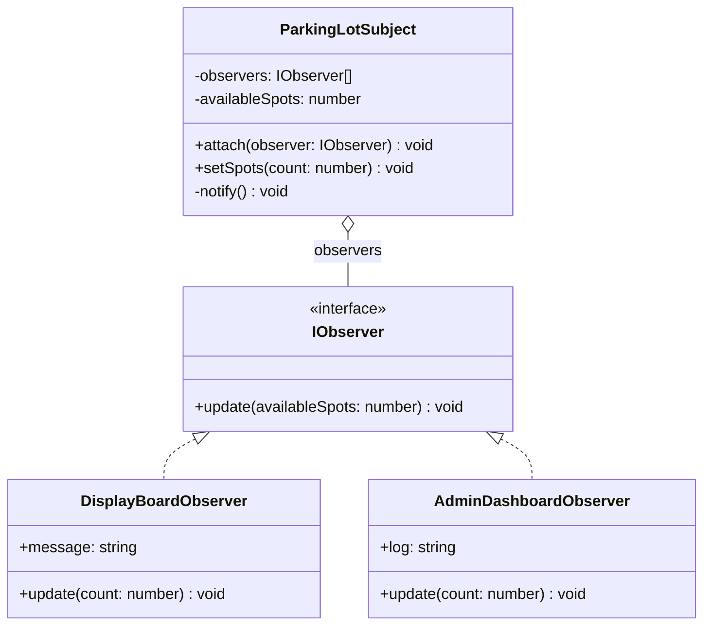

# Observer Pattern

Observer pattern mendefinisikan ketergantungan satu-ke-banyak antara objek sehingga ketika satu objek berubah status, semua objek yang bergantung padanya akan diberitahu dan diperbarui secara otomatis.

## Diagram Kelas



## Penggunaan

```typescript
const parkingLot = new ParkingLotSubject();
const display = new DisplayBoardObserver();
const admin = new AdminDashboardObserver();

parkingLot.attach(display);
parkingLot.attach(admin);
parkingLot.setSpots(5); // Kedua observer diberitahu
```
