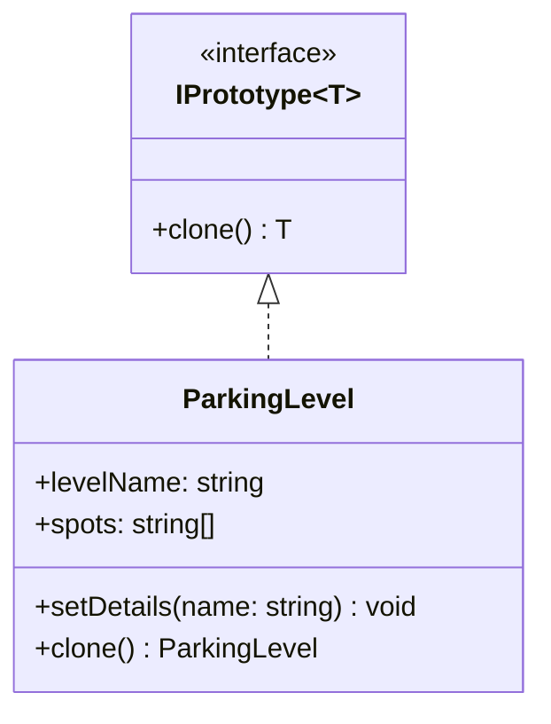

# Prototype Pattern

Prototype pattern menentukan jenis objek yang akan dibuat menggunakan instance prototipe, dan membuat objek baru dengan menyalin prototipe ini.

## Diagram Kelas



## Penggunaan

```typescript
const originalLevel = new ParkingLevel("Level A", 3);
const clonedLevel = originalLevel.clone();

console.log(originalLevel.levelName); // "Level A"
console.log(clonedLevel.levelName);   // "Copy of Level A"
console.log(clonedLevel.spots);       // ["Spot-1", "Spot-2", "Spot-3"]
```
