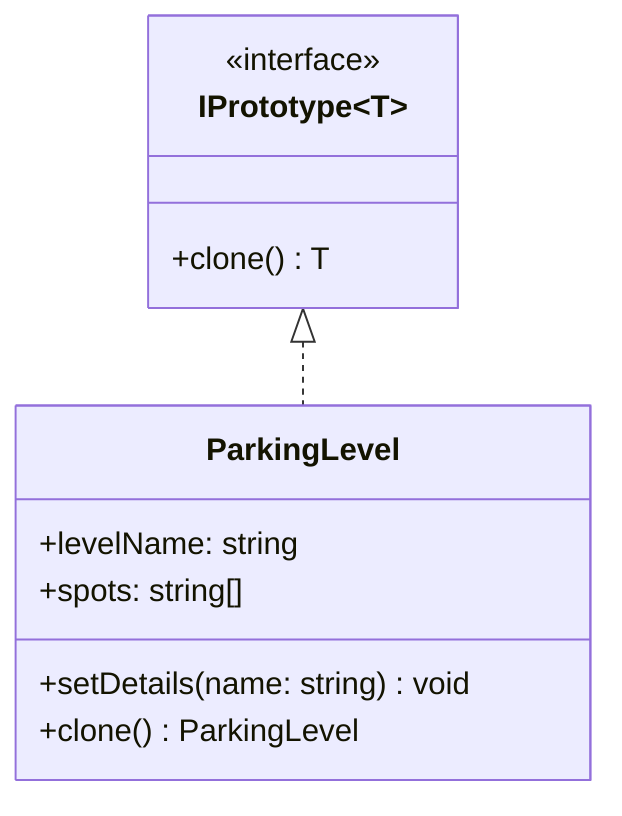

# Prototype Pattern

The Prototype pattern specifies the kinds of objects to create using a prototypical instance, and creates new objects by copying this prototype.

## Class Diagram



## Usage

```typescript
const originalLevel = new ParkingLevel("Level A", 3);
const clonedLevel = originalLevel.clone();

console.log(originalLevel.levelName); // "Level A"
console.log(clonedLevel.levelName);   // "Copy of Level A"
console.log(clonedLevel.spots);       // ["Spot-1", "Spot-2", "Spot-3"]
```
