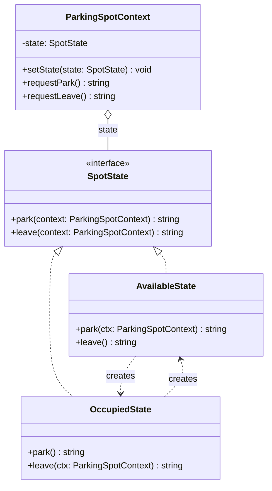

# State Pattern

State pattern memungkinkan objek mengubah perilakunya ketika status internalnya berubah. Objek akan tampak berubah kelasnya.

## Diagram Kelas



## Penggunaan

```typescript
const spot = new ParkingSpotContext();
spot.requestPark();  // "Park successful. State changed to Occupied."
spot.requestPark();  // "Spot is full!"
spot.requestLeave(); // "Vehicle left. State changed to Available."
```
