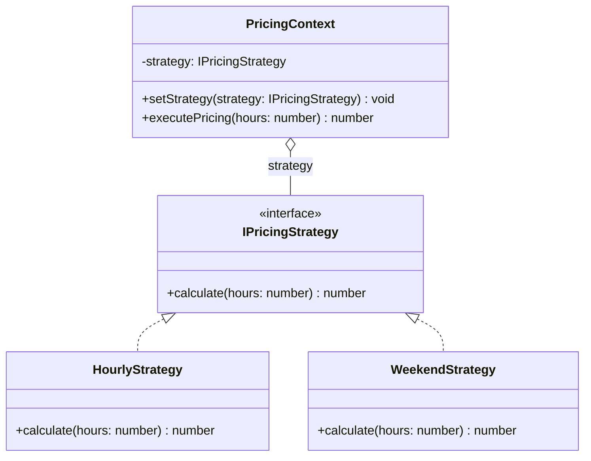

# Strategy Pattern

The Strategy pattern defines a family of algorithms, encapsulates each one, and makes them interchangeable. Strategy lets the algorithm vary independently from clients that use it.

## Class Diagram



## Usage

```typescript
const pricing = new PricingContext(new HourlyStrategy());
pricing.executePricing(5); // 15000 (5 * 3000)

pricing.setStrategy(new WeekendStrategy());
pricing.executePricing(5); // 25000 (5 * 5000)
```
