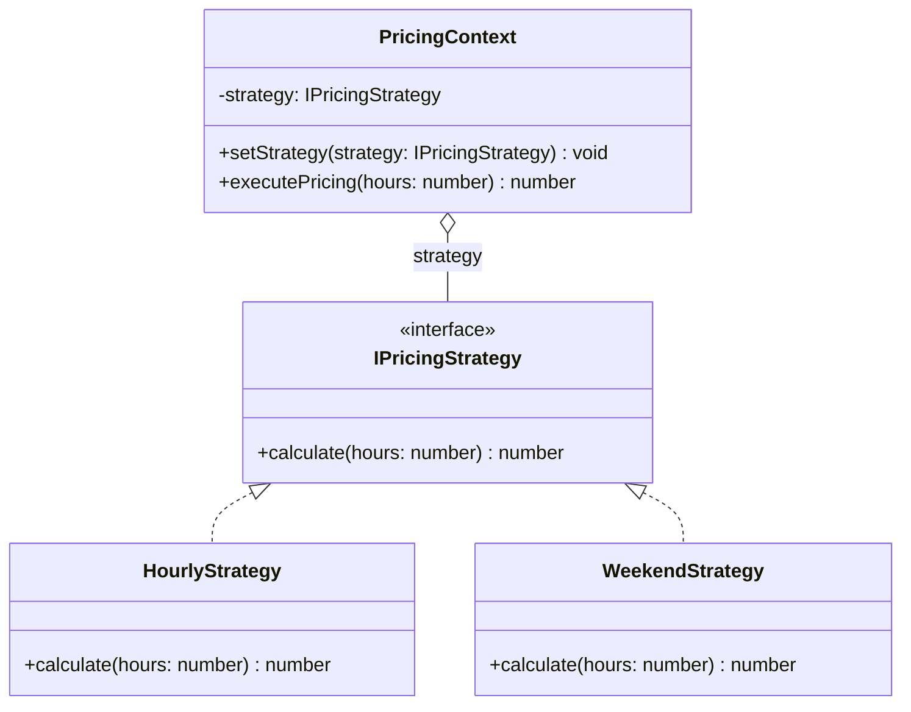

# Strategy Pattern

Strategy pattern mendefinisikan keluarga algoritma, mengenkapsulasi masing-masing, dan membuatnya dapat dipertukarkan. Strategy memungkinkan algoritma bervariasi secara independen dari klien yang menggunakannya.

## Diagram Kelas



## Penggunaan

```typescript
const pricing = new PricingContext(new HourlyStrategy());
pricing.executePricing(5); // 15000 (5 * 3000)

pricing.setStrategy(new WeekendStrategy());
pricing.executePricing(5); // 25000 (5 * 5000)
```
